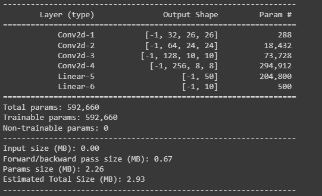
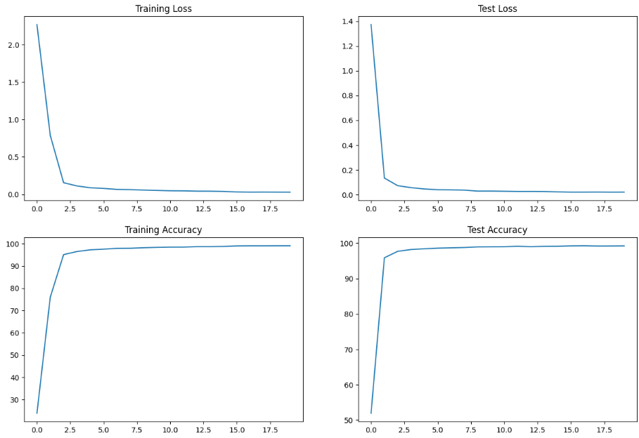

# ERA - Assignment 5

This repo is the solution for the ERA v1 assignment 5. The MNIST model training has been modularised into three files:
1) S5.ipynb
2) model.py
3) utils.py

The notebook file(S5.ipynb) contains the workflow to train model on MNIST dataset. It imports the two files model.py and utils.py.

The file model.py contains the model architecture and can be extended with other model architectures.

The file utils.py contains supporting generic function to get accuracy and loss for train/test dataset.
It also contains function to plot the metrics graph.


## Usage/Examples

```python
import model

model_summary = model.Net().to(device)
summary(model_summary, input_size=(1, 28, 28))
```

```python
import utils

utils.plot_graphs(train_losses,train_acc,test_losses,test_acc)
```
## Screenshots

Using torch summary to get the model summary defined in model.py


Using utils to plot the metrics graph


