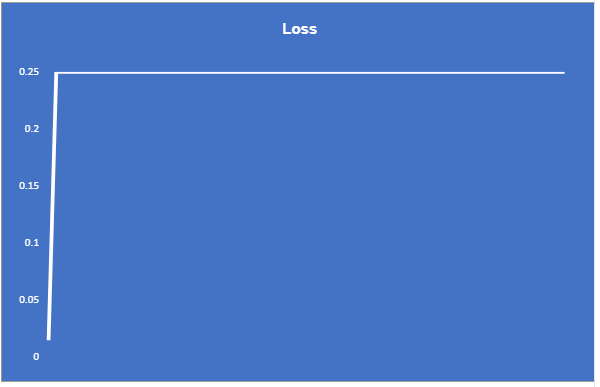

# ERA - Assignment 6

This repo is the solution for the ERA v2 assignment 6.   
Here we demonstrate the back-propagation for updation of weights considering the simple neural network. The following are the steps followed:
1) i1 and i2 forms the input layer 
2) w1 and w3 are weights from i1 to h1 and h2 correspondingly, similarly we have weights w2 and w4 from i2 to h1 and h2.
3) Sigmoid activation is applied on h1 and h2 to give out_h1 and out_h2.
4) w5 and w7 are weights from out_h1 to o1 and o2 correspondingly, similarly we have weights w6 and w8 from out_h2 to o1 and o2.
5) Again, sigmoid activation is applied on the outputs o1 and o2 to give out_o1 and out_o2.
6) These out_o1 and out_o2 are compared with the actual values which was expected(target 01 and target o2) to calculate E1 and E2 which constitute the total loss.
7) For the back-propagation, we have to calculate the partial derivative of loss wrt to weights. 
8) In excel sheet, the values for t1 and t2 is taken as 0.5.
9) For further computation in excel sheet, the weights values are taken as shows in figure Simple Neural network below.
10) h1 is computed as i1 * w1 + i2 * w2 (similarly we calculate h2 ie, multiplying weights with the inputs)
11) a_h1 is sigmoid on h1 [Sigmoid is applied to introduce non-linearity. It is calculated as 1/(1+EXP(-x))]
12) The same operation is carried on for next layer to compute o1, o2 and their sigmoid activations as a_o1 and a_o2 respectively.
13) We compute the derivatives(partial) of loss with respect to weights from w1 to w8.
14) For the next iteration we use the calculated derivatives to adjust the weights. Considering the learning rate as 1,
w1 for next iterations is given by w1 - LR * dE / dw1, the same formula is used to compute other weights.

Learning Rate Observations

Learning rate is a hyper-parameter we use in our network that defines the adjustment in the weights of our network with respect to loss gradient descent. Keeping a higher learning rate means we move faster towards the optimal weight, where there is possibility we might skip the optimal solution while a lower learning rate means we will need many iterations to converge.        

In our example, Keeping learning rate as 0.1, we got a straight line with a very less decrease in loss. This means although our model is learning, it's learning at a very slow rate. On increasing the learning rate to 0.2 to 0.5 and then to 0.8, we observe a curve, with further decrease in loss. The optimal curve is observed with learning rate as 1 and 2 for our data. However on incresing the learning rate to a very high value, 1000, the loss spikes and increases. Thus, concluding that both very loss and very high values for learning rate are not optimal.

 

## Screenshots

Simple Neural Network (considered for excel computations)

Excel Sheet

Learning Rate: 0.1

Learning Rate: 0.2

Learning Rate: 0.5

Learning Rate: 0.8

Learning Rate: 1.0

Learning Rate: 2.0

Learning Rate: 1000

