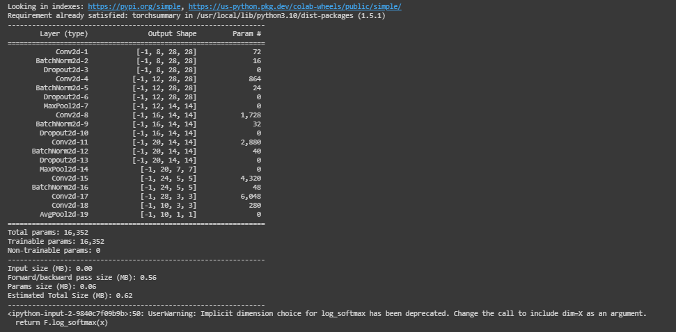
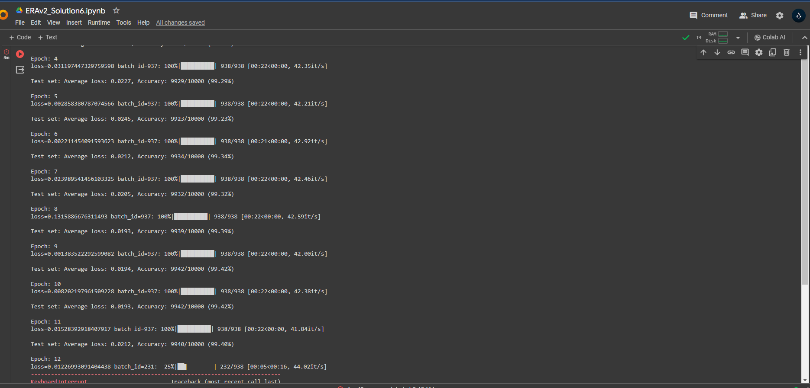

# ERA - Assignment 6

This repo is the solution for the ERA v2 assignment 6.   
The new architecture for model achieves accuracy of 99.44% with 16k parameters in 20 epochs. As per suggested in the lecture, we have used batch normalisation and drop out after every layer,
except before the final layer. Max pool layer is used only twice and Global average pooling layer is final layer before softmax. Batch size is take as 64 as per the graph.


## Screenshots

Model summary for new model architecture



Model Accuracy



## Logs

```python
Epoch: 1
  0%|          | 0/938 [00:00<?, ?it/s]<ipython-input-3-9840c7f09b9b>:50: UserWarning: Implicit dimension choice for log_softmax has been deprecated. Change the call to include dim=X as an argument.
  return F.log_softmax(x)
loss=0.08294094353914261 batch_id=937: 100%|██████████| 938/938 [00:27<00:00, 34.51it/s]

Test set: Average loss: 0.0450, Accuracy: 9856/10000 (98.56%)

Epoch: 2
loss=0.05139518156647682 batch_id=937: 100%|██████████| 938/938 [00:22<00:00, 42.39it/s]

Test set: Average loss: 0.0308, Accuracy: 9901/10000 (99.01%)

Epoch: 3
loss=0.015646889805793762 batch_id=937: 100%|██████████| 938/938 [00:22<00:00, 41.09it/s]

Test set: Average loss: 0.0261, Accuracy: 9905/10000 (99.05%)

Epoch: 4
loss=0.031197447329759598 batch_id=937: 100%|██████████| 938/938 [00:22<00:00, 42.35it/s]

Test set: Average loss: 0.0227, Accuracy: 9929/10000 (99.29%)

Epoch: 5
loss=0.002858380787074566 batch_id=937: 100%|██████████| 938/938 [00:22<00:00, 42.21it/s]

Test set: Average loss: 0.0245, Accuracy: 9923/10000 (99.23%)

Epoch: 6
loss=0.002211454091593623 batch_id=937: 100%|██████████| 938/938 [00:21<00:00, 42.92it/s]

Test set: Average loss: 0.0212, Accuracy: 9934/10000 (99.34%)

Epoch: 7
loss=0.023989541456103325 batch_id=937: 100%|██████████| 938/938 [00:22<00:00, 42.46it/s]

Test set: Average loss: 0.0205, Accuracy: 9932/10000 (99.32%)

Epoch: 8
loss=0.1315886676311493 batch_id=937: 100%|██████████| 938/938 [00:22<00:00, 42.59it/s]

Test set: Average loss: 0.0193, Accuracy: 9939/10000 (99.39%)

Epoch: 9
loss=0.001383522292599082 batch_id=937: 100%|██████████| 938/938 [00:22<00:00, 42.00it/s]

Test set: Average loss: 0.0194, Accuracy: 9942/10000 (99.42%)

Epoch: 10
loss=0.008202197961509228 batch_id=937: 100%|██████████| 938/938 [00:22<00:00, 42.38it/s]

Test set: Average loss: 0.0193, Accuracy: 9942/10000 (99.42%)

Epoch: 11
loss=0.01528392918407917 batch_id=937: 100%|██████████| 938/938 [00:22<00:00, 41.84it/s]

Test set: Average loss: 0.0212, Accuracy: 9940/10000 (99.40%)

Epoch: 12
loss=0.01226993091404438 batch_id=231:  25%|██▍       | 232/938 [00:05<00:16, 44.02it/s]
---------------------------------------------------------------------------
KeyboardInterrupt                         Traceback (most recent call last)
<ipython-input-7-1d9da21d5910> in <cell line: 4>()
      4 for epoch in range(1, 21):
      5   print('Epoch:',epoch)
----> 6   train(model, device, train_loader, optimizer, epoch)
      7   test(model, device, test_loader)

2 frames
/usr/local/lib/python3.10/dist-packages/torch/autograd/__init__.py in backward(tensors, grad_tensors, retain_graph, create_graph, grad_variables, inputs)
    249     # some Python versions print out the first line of a multi-line function
    250     # calls in the traceback and some print out the last line
--> 251     Variable._execution_engine.run_backward(  # Calls into the C++ engine to run the backward pass
    252         tensors,
    253         grad_tensors_,

KeyboardInterrupt: 


```

